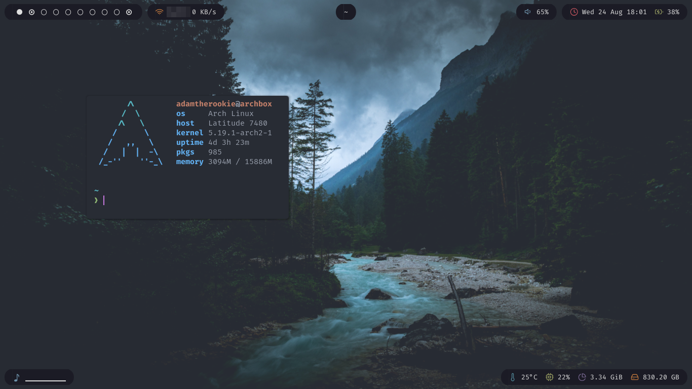
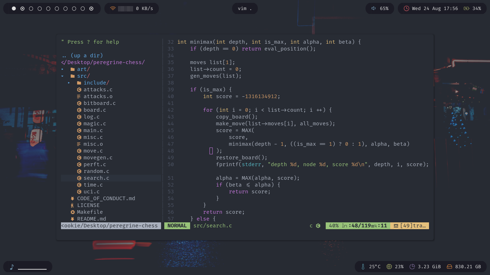
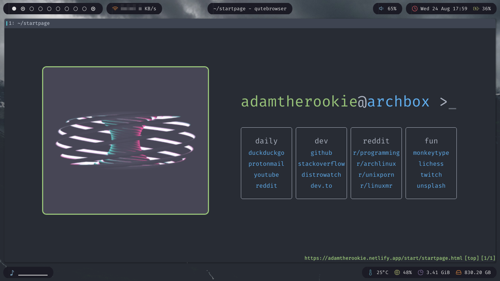

# bspwm-dots2
My new bspwm dotfiles.
Wallpapers from [https://github.com/UnnatShaneshwar/OneDarkWallpapers](https://github.com/UnnatShaneshwar/OneDarkWallpapers)

```
                   -`                    adamtherookie@archbox 
                  .o+`                   --------------------- 
                 `ooo/                   OS: Arch Linux x86_64 
                `+oooo:                  Host: Latitude 7480 
               `+oooooo:                 Kernel: 5.19.1-arch2-1 
               -+oooooo+:                Uptime: 3 hours, 28 mins 
             `/:-:++oooo+:               Packages: 1003 (pacman) 
            `/++++/+++++++:              Shell: zsh 5.9 
           `/++++++++++++++:             Resolution: 1366x768 
          `/+++ooooooooooooo/`           WM: bspwm 
         ./ooosssso++osssssso+`          Theme: Adapta-Nokto [GTK2/3] 
        .oossssso-````/ossssss+`         Icons: Papirus [GTK2/3] 
       -osssssso.      :ssssssso.        Terminal: kitty 
      :osssssss/        osssso+++.       CPU: Intel i7-7600U (4) @ 3.900GHz 
     /ossssssss/        +ssssooo/-       GPU: Intel HD Graphics 620 
   `/ossssso+/:-        -:/+osssso+-     Memory: 2579MiB / 15886MiB 
  `+sso+:-`                 `.-/+oso:
 `++:.                           `-/+/                           
 .`                                 `/                           
 ```

# Screenshots



